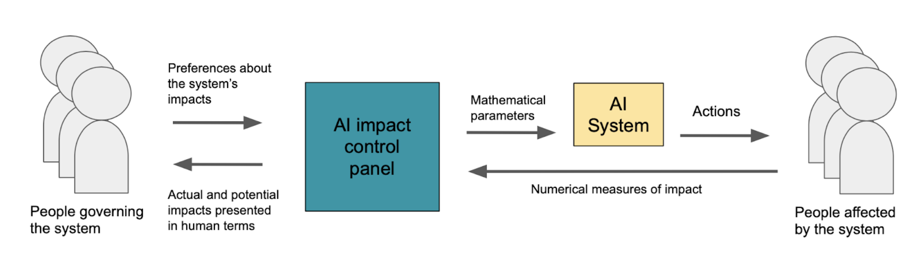

# AI Impact Control Panel

An interactive application for decision-makers to help understand and control
the impacts of their AI systems.

© 2022 Gradient Institue Ltd.

**This code is at an Alpha (early) level of development: frequent and substantial changes in functionality are likely to occur.**

## What is it?

This tool helps decision-makers understand and control the impacts of their AI
systems. It helps the decision-maker select between system 'candidates'. These
are potential configurations of the system that could be deployed. They might,
for example, be 

- different machine learning models (e.g. random forest, linear model)
- different hyperparameter settings (e.g. fairness regularization strength)
- different approaches entirely (e.g. human-based decision-making, machine
  learning).

These candidates are not generated by the control panel and form an input that
users must provide when configuring. In addition to these parameter settings,
the user must also supply the candidates performance with respect to the
metrics they are using to evaluate the system. With this information as input,
the control panel providesa decision-maker

- an interactive interface to visualise different system 'candidates' and their
  impacts, for example, where each candidate might be a different ML model that
  could be deployed, or a different algorithm configuration (decision
  thresholds, regularising parameters, strengths of different terms in the
  objective function)
- an filtering interface to rule out candidates that are obviously
  unacceptable
- an elicitation alogrithm that finds decision-makers' most-preferred candidate
  by asking a series of guided questions.
- a record of the questions posed by the tool and the decisions made by the user for the purpose of ensuring the reasons for choosing a given system can be explained.

## What do I need to use it with my AI system?

## How do I get it running?

0. You'll need docker and docker-compose installed to run the app locally.
1. Place your scenario information in the ``scenarios`` folder, which will be
   mounted by docker compose.
2. Optionally, see the instructions below for generating some demo scenarios.
3. Run ``docker-compose up`` which should build and run the containers
   required.
4. Access ``http://localhost/aicontrolpanel`` in your browser for the app.

## Can I contribute to development?

### Installation

1. Install python-poetry
2. run ``poetry install`` in this directory

Note: there is no need to do a pip install -e . : this happens automatically, 
along with venv creation and dependencies.

To get into a venv, do ``poetry shell``.

### Running the server for development

Go to the server folder. start the backend with ``server/mlserver/run_dev.sh``

To start the frontend, go to ``server/deva-ts`` and from there run ``yarn
start``.

### Testing

In the venv, run ``pytest``.
