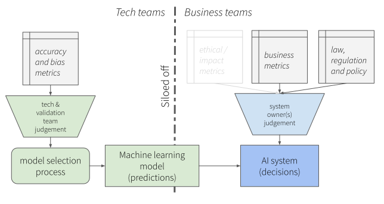
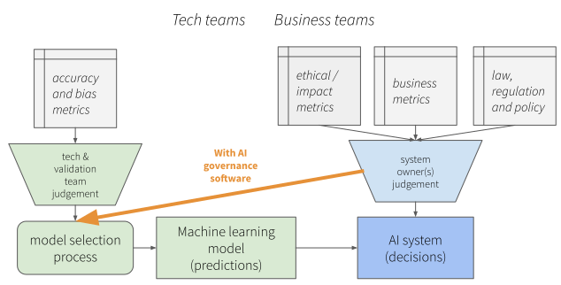

.. _context:

Project Context and Purpose
===========================

Too many high-profile incidents have demonstrated that poorly designed
artificial intelligence (AI) systems can cause significant harm to many people.
This problem will continue to worsen as AI is deployed making more
consequential decisions for more people. Such harms are happening in banking,
government service provision, law enforcement, education, social media and in
many other areas of society. One way in which society will need to deal with
this issue is with government regulation and some governments are already
starting down the path toward implementing AI regulation. For example, the EU
has recently released a draft AI regulation and several US regulators have
signalled that AI regulations are coming. The Australian Human Rights
Commission have released recommendations for regulations on AI. Any AI
regulation is likely to be focussed on the relevant impacts of an AI system and
prohibit intended or unintended harms or inequities created by their operation.
However, despite the existence of such regulation, most organisations using AI
will not be in a good position to govern their AI systems because of the
challenge posed by overseeing an AI system.

One of the key causes of AI's harmful impact is that AI systems are designed to
achieve an extremely narrow objective: usually maximising the average accuracy
of their predictions across a large number of people - whether that be, for
example, all of a bank's customers, all citizens represented by a government or
all users of a specific digital platform. The broader impact of the system's
operation on the people is rarely explored. This means that businesses or
governments operating an AI system do not even know what all its impacts on
people are, let alone how to alter these impacts.

AI systems are generally flexible in how they operate: there are many changes
that can be made to their design to adjust their behaviour and favour some
outcomes over others. For example, an AI-based spam filter can be tuned to
focus more on removing spam messages (perhaps catching innocent messages in the
spam filter) or ensuring legitimate messages are let through (perhaps also
letting through some spam). Equivalent levers are available for businesses and
governments for their AI systems that affect the treatment of people (for
example, their customers or citizens). They are rarely used however, because
organisations have no way to understand the different possible impacts that
changing these levers creates.

This means that an AI system deployed by a bank to approve loans, for example,
might be 'performing well' by its measure of average predictive accuracy
(giving out loans to people who repay them) but it may be that most of the
loans it mistakenly denies are from female applicants. The business running
this loan system could reduce or eliminate this negative impact, but a) they
don't know it's happening and b) they don't have the tools to understand what
aspect of the design of the AI needs to be altered, and what the effect of that
alteration would be on the system's operation.

As a result, the system acts according to parameters typically set by data
scientists designing the system. These data scientists may be unaware of the
significant consequences their choices may be having, and of the huge
responsibility that has been left to them, unbeknownst to the senior decision
makers in the organisation that should be bearing this responsibility.

.. _dev_process_common:

    A depiction of a typical AI development process in an organisation. A lot
    of the algorithmic development may happen without involvment of senior
    decision makers. Thus there is a danger that the wider system impacts and
    organisational strategy is not taken into account until system deployment.

We have created 'Deva' as a means to help senior decision makers and data
scientists jointly develop these AI systems, see :numref:`dev_process_tool`.

.. _dev_process_tool:

    A depiction of the AI development process when using Deva. Now senior
    decision makers are involved in the model selection process before the
    system is deployed. This allows for additional considerations to be
    factored into the development of an AI system such as business, ethical and
    regulatory constraints and objectives. It also allows for these design
    decisions to be documented.

Using Deva requires as a pre-condition that all objectives and constraints for
an AI system have been established and measured where possible since these are
input into the software. Capturing all of these objectives and constraints is a
process that involves not only the system developers and senior decision
makers, but also potentially a wider gamut of people the system effects.

Once these objectives and constraints have been captured in mathematical
measures, the data science team then can develop the underlying statistical or
machine learning models in light of them.

It is typically impossible to satisfy all objectives simultaneously, especially
when they conflict. AI systems typically do have conflicting objectives as the
previously mentioned examples demonstrate. When the data scientists develop
their AI models, they can create multiple candidates that trade-off these
objectives in different amounts.

The *purpose* of Deva is to expose these different objectives to a person or
people responsible for an AI system so that they can choose an AI model that
appropriately trades off these objectives.

TODO elaborate and talk about documentation.

