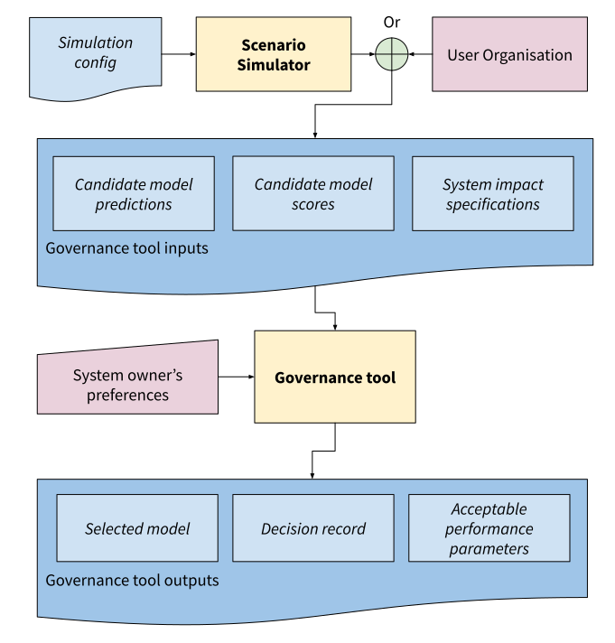
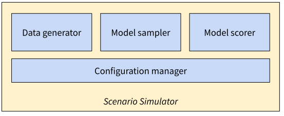

.. _section1:

Section 1: Major Components
===========================

The main output of this work is a software tool to assist AI system owners in
selecting acceptable and realisable combinations of performance metrics for
their system, balancing the organisation's competing objectives in an ethical
and accountable way.

This 'governance tool' functions by asking a series of questions to the system
owner through a web interface. These questions may relate to the relative
importance of different objectives, or to the relative desirability of different
outcomes. These questions are being selected by an elicitation algorithm, which
tries to characterise which realisable combinations of performance metrics are
acceptable to the user. The software tools are designed in a modular way so that
different elicitation algorithms can easily be added over time.

We hypothesise that how the questions are presented to the user will have a big
impact on their decisions and on their ability to use the tool. Therefore we
intend to also create a modular system for visualisations of performance
comparisons. This will be, as much as possible, independent of the elicitation
system and communicate through well-defined Application Programming Interfaces
(APIs).   

To provide an environment for testing and exploration of different elicitation
algorithms and visualisations, we provide a 'scenario simulator' to generate the
inputs that would normally be obtained from the user organisation. This tool is
built around fraud detection in credit-card transactions, and simulates data and
models for this use case. The simulation is designed to be highly configurable
so as to allow us to explore different scenarios, (more or less accurate models,
noise levels, relationships between target variable and demographics etc.).
:numref:`fig_systemIO`, below, depicts the process of using these tools and
their specific inputs and outputs. We have also provided a very simple job
recommendation scenario that will work 'out of the box' - with no generation
necessary.

.. _fig_systemIO:

    Process diagram depicting the inputs and outputs of the org sim and
    governance tool. The first step is for the user organisation to collate the
    inputs required for the governance tool: these are a set of candidate model
    predictions, along with scores for their selected metrics, and additional
    specifications on the system’s impacts. For exploratory development, the
    scenario simulator can be used to generate these inputs from a configuration
    file as a stand-in for a real organisation.  The governance  tool uses these
    inputs to elicit preferences about potential impacts from the system owner.
    At the end of this process the governance tool outputs a selected model
    along with a record of how this decision was arrived at for accountability
    purposes.

The following sections provide more detail about the structure and function of
these two tools, and their sub-components.

Scenario Simulator
------------------

The scenario simulator generates inputs to the AI governance tool. Normally
these inputs would be provided by the user, but having an ability to generate
plausible but fictional data and models without a partner organisation will help
us develop and test the AI governance tool and do so for a wide range of
scenarios in future. 

The scenario simulator is currently based on a credit-card fraud transaction
use-case (detailed in :ref:`fraud_scen`). 

The simulator performs three functions: generating data from a statistical
model, training a series of AI models on that data from which the governance
tool will select, and ‘scoring’ these models by measuring their performance
against a defined set of metrics using held-out data. Each of these functions is
performed by a separate component in the code, outlined in
:numref:`fig_simulator` below.

.. _fig_simulator:

    Internal structure of the scenario simulator.

Data Generator
..............

Function
~~~~~~~~

The data generator implements a statistical model that defines how the different
features in the data relate to each other, and generates ‘random’ data
consistent with these relationships.  The following simplified example
illustrates this process. 

The simulator might assume that incidence of fraud in a transaction is related
to the customer’s income, which in turn depends on their gender. The data
generator would first, from a configuration file, determine the size of  a
hypothetical customer cohort. Each of these synthetic customers needs a gender
and an income, so it would first read the fraction of males in the cohort from
the configuration file, then randomly assign the synthetic customers' genders
based on this fraction. 

Next, the tool might assign each customer an income, assuming that these incomes
follow a ‘power law’ distribution, but with a dependence on gender. The
configuration file specifies separate coefficients for males and females for
this power law, enabling the tool to randomly assign incomes accordingly.
Finally, for each customer a number of transactions is generated, which are
randomly assigned as fraudulent or not with a chance based on the customer’s
income.

Arbitrarily large numbers of customers and transactions can be sampled in this
way,  enabling the tool to generate training and testing datasets to be used by
the other components.

Inputs and outputs
~~~~~~~~~~~~~~~~~~

The inputs to the data generator is a configuration file specifying the various
parameters of the simulation. The outputs of the data generator are tabular
data suitable for training and scoring models.

See :ref:`datasim` and :ref:`scripts` for detailed documentation.

Model Sampler
.............

Function
~~~~~~~~

The model sampler trains a configurable number of different predictive models on
the data generated by the data generator. The governance tool will help the
system owner select one of these models. The sampler tries to ensure that the
models have different performance characteristics by varying their
'hyperparameters' (parameters that control how the model learns from data).
Hyperparameters from each model are drawn from lists and ranges specified in the
scenario configuration file.  

Inputs and outputs 
~~~~~~~~~~~~~~~~~~

The inputs to the model sampler are training and testing data (features and
targets) from the data generator, and hyperparameter ranges in a configuration
file. The outputs of the model sampler are predictions made on the testing
data. 

See :ref:`model` and :ref:`scripts` for detailed documentation.

Model Scorer
............

Function
~~~~~~~~

The model scorer assesses the performance of the generated models using metrics
provided by the user in the scenario configuration. These metrics are
quantifiable representations of concepts that the user believes are important
characteristics of the system. 

For example, when detecting fraud, the user will likely care about the rate at
which the system correctly flags fraudulent transactions. This concern can be
captured by providing the model scorer with the true positive rate (or
sensitivity) as a metric to evaluate the system against.

Similarly, the user may worry about the system targeting certain individuals
with a disproportionate number of erroneous fraud labels. The distribution of
the system's areas across the population can be captured using a metric like the
Gini coefficient.

Inputs and outputs 
~~~~~~~~~~~~~~~~~~

The model scorer ingests models and metrics provided by the user. It assesses
the models’ performances using these metrics and returns the resulting scores to
the user and/or as input to the governance tool.

See :ref:`model`, :ref:`score` and :ref:`scripts` for more information.

.. _fraud_scen:

Fraud Scenario
..............

For the purposes of developing and testing the governance tool, Gradient
constructed a hypothetical use-case around automated fraud detection. In this
scenario, a bank is deploying an AI system to automatically detect fraud within
a stream of credit card transactions. Individual transactions are assessed in
terms of their amount, vendor type, features of the card's recent transactions
and features of the customer. The AI system then predicts whether a given
transaction is expected to be fraudulent. The system will automatically block
any card that is flagged as a fraudulent transaction, but the customer may then
choose to unblock the card if they confirm with the bank that the transaction
was legitimate, or report a fraud if the system has missed it.

As with any AI system, careful and ongoing analysis to check for risks of
unintentional harm or discrimination is vital in this scenario. AI systems can
inadvertently advantage or disadvantage some groups or individuals compared to
others. Inequality could arise, for example, if the system was more accurate at
detecting fraud for some groups or individuals than others. There might also be
fairness concerns if the base rate of fraud was higher for some groups or
individuals than others. We frame the implications of these problems in terms of
system impacts below. 

Detailed scenario descriptions and metrics can be found in the scenario metadata
files, :ref:`fraud`.

Impacts: Errors in Prediction
~~~~~~~~~~~~~~~~~~~~~~~~~~~~~

The fraud detection system incurs two types of errors - false negatives and
false positives.

**False negatives**

A false negative occurs when the system fails to notice and prevent a fraudulent
transaction. These errors are typically identified after some delay, when the
customer receives their monthly account summary. 

From the bank's perspective, a false negative typically results in a financial
loss  as the bank is required to compensate the customer while rarely being able
to recoup this loss from the fraudster. 

From the customer's perspective, false negatives are, at best, an inconvenience
because of the time and effort required to notify the bank of their system’s
mistake. At worst, the fraudulent transactions may also go unnoticed by the
customer resulting in a financial loss for them.

**False positives**

A false positive occurs when the system incorrectly flags a legitimate
transaction as fraudulent. This requires the customer to inform the bank that a
mistake was made by the detection system before the transaction can proceed. 

In some cases, the customer may simply use a credit card from a different
provider resulting in a loss of transaction revenue for the bank. A customer
subjected to repeated errors may be inconvenienced enough to decide to
permanently switch financial institutions, resulting in a financial loss for the
bank.

Impacts: Responsible AI considerations
~~~~~~~~~~~~~~~~~~~~~~~~~~~~~~~~~~~~~~

**Customer wellbeing**

Given that false positives and false negatives are both harmful to customers, a
clear ethical objective of the system is to minimise both error types - the idea
being that a system that makes fewer errors is less harmful. Obviously the
system should be optimised as much as possible given the data available, but it
is expected that even an optimised system will make some errors. It will then be
necessary to decide how to tune the system to balance false positives against
false negatives.  While this optimisation and balancing closely relates to
business objectives, determining whether a given system performance is
acceptable, and what the desired  balance between different types of errors
requires explicit consideration of business and customer impact because the
harms to the customers and the costs to the bank are different.

**Individual fairness**

Regardless of how many errors the system makes, individual fairness relates to
whether a small fraction of individuals bear a disproportionate fraction of the
total system errors. Even if a system is accurate overall, a few individuals may
still  experience a disproportionately high error rate. For example, a
customer's circumstances might require them to conduct legitimate transactions
with features that resemble fraudulent transactions. We typically examine such
impacts by measuring how evenly dispersed the system's errors are, or by
examining the peak number of errors that the worst off individuals experience.

**Group fairness**

Fraud systems leverage information from a wide range of sources when determining
whether to flag each transaction as fraudulent or not. Some of this information
relates directly to the customer and often correlates strongly with demographic
features. For example, even if a system does not directly use gender in its
decision making, male and female spending patterns are expected to be different.
Group fairness relates to whether some demographic groups experience more harm
than others (on average).

AI Governance Tool
------------------

Scenario Summariser
...................

Acceptable Boundary of Operation
................................

TODO

Deployment System
.................

Candidate Filter
~~~~~~~~~~~~~~~~

* Pareto set filter
* Acceptable bounds filter

Elicitation Engine
~~~~~~~~~~~~~~~~~~

Visualisations
~~~~~~~~~~~~~~

User Interface
~~~~~~~~~~~~~~
